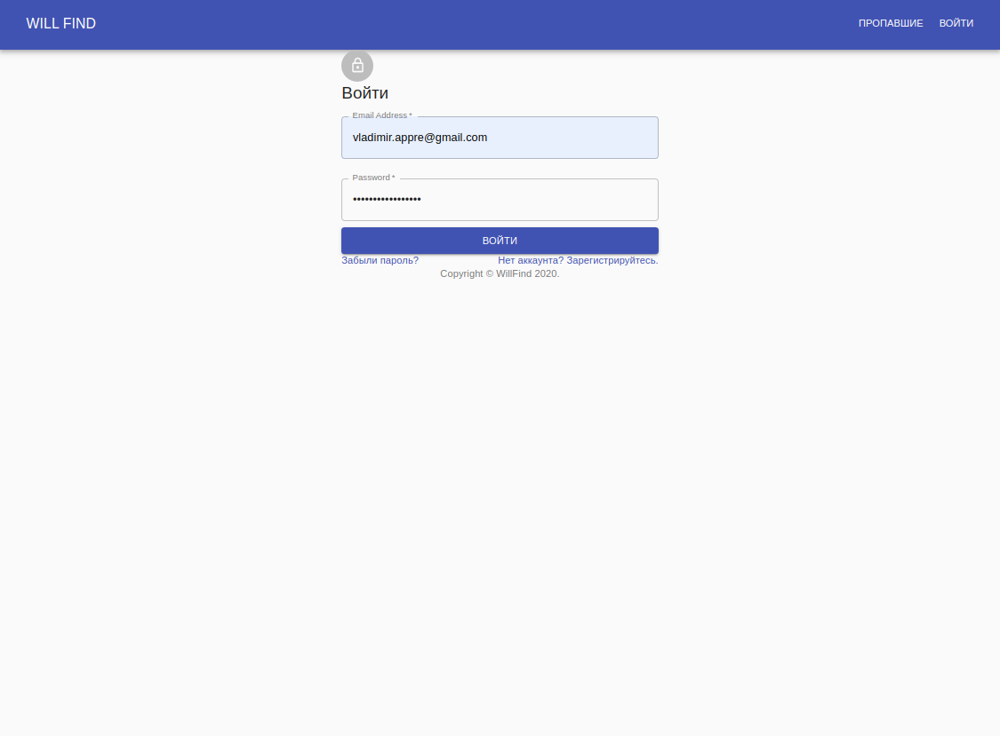
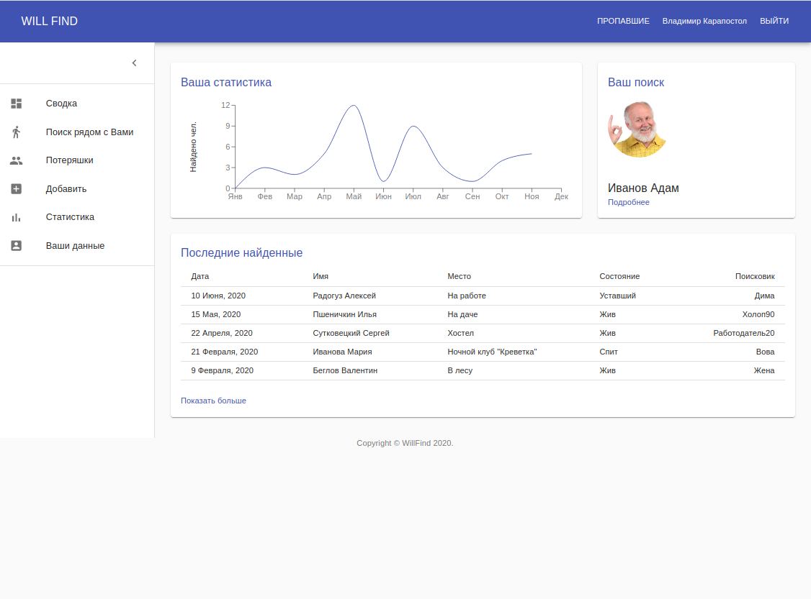
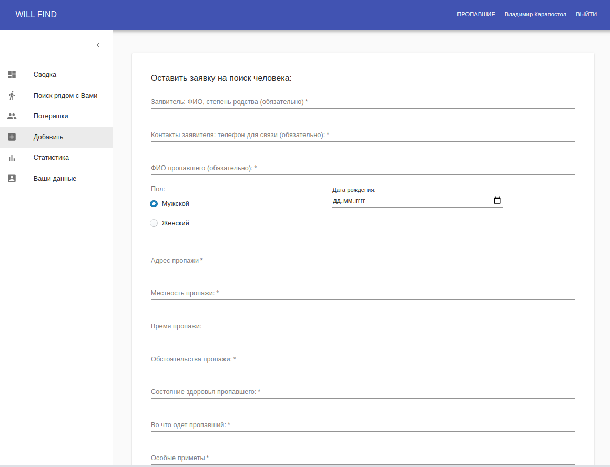
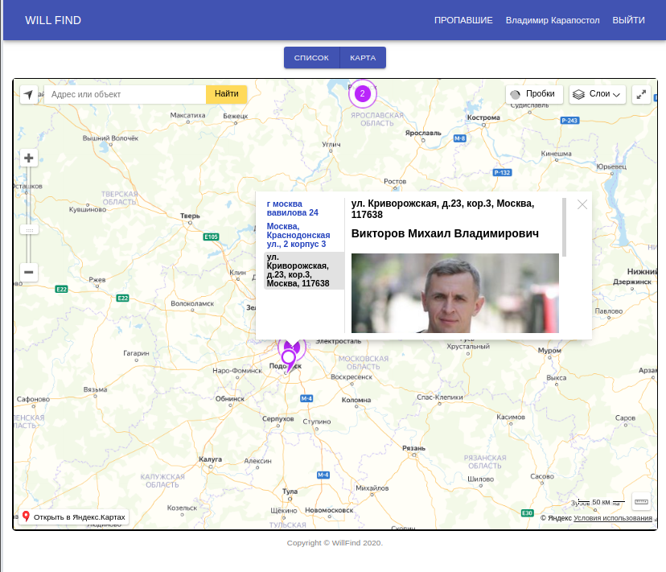
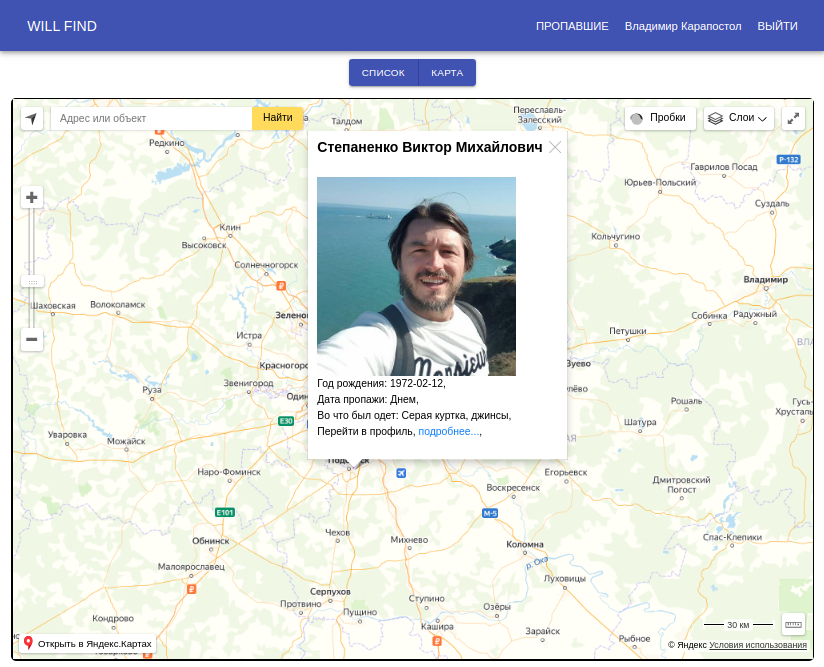

# WillFind
Сайт для поиска потервшихся людей.
Вы можете создать анекту  пропавшего человекаи и отметить его на карте. Добровольцы могут взаимодействоать с данной меткой на карте, а так же удобно могут посмотреть бегло краткую информацию а при необходимости посмотреть более подробную и перейти в беседу где так же собрались другие Добровольцы и общаться между собой или связаться с создателем данной анкеты.

### Установка проекта:
Открываем терминал на две части, либо два терминала в зависимоти как вам удобно, в одном frontend в другом запускаем backend
Заупускаем фронт: 
  1) npm i
  2) npm start

Запускаем сервер:
  1) cd backend/
  2) npm i
  3) npm start

  ### Главная страница:

Для поиска людей мы можете просто перейти во вкладку поиска людей, 
но для того чтоб зарегестрироать новых или отписаться на сайте вам нужно зарегестрироваться либо войти под своим аккаунтом.

*Рисунок 1. Главная страницы* 

  ### Вход или регистрация: 

*Рисунок 2. Вход/регистрация* 

  ### Личный кабинет: 

Тут можете просмотреть вашу статисику и отредактировать свои данные

*Рисунок 3. Статистика* 

  ### Анкета искомого человека: 

Тут заполняете данные искомого человека, прикрепляете фотографию.

*Рисунок 4. Анкета* 

  ### Отображение на карте: 
  Если смотреть на населенный пункт с далека, точки обьединяются в группах, на карте отображается количество искомых людей, при клике с левой стороны появляется панель с адресом 
а с правой краткая информация о человеке и его фотография. Далее можете перейти в "подробнее" и увидеть полную информацию.
Если  приблизить карту, точки отображаются в зависимости от указанного адреса.

*Рисунок 5. Карта удаленно* 

*Рисунок 6. Карта приближенно*

  ### Отображение  в виде списка: 

Для тех кому не удобно смотреть на карту, есть возможность поиска людей  в формате списка.

